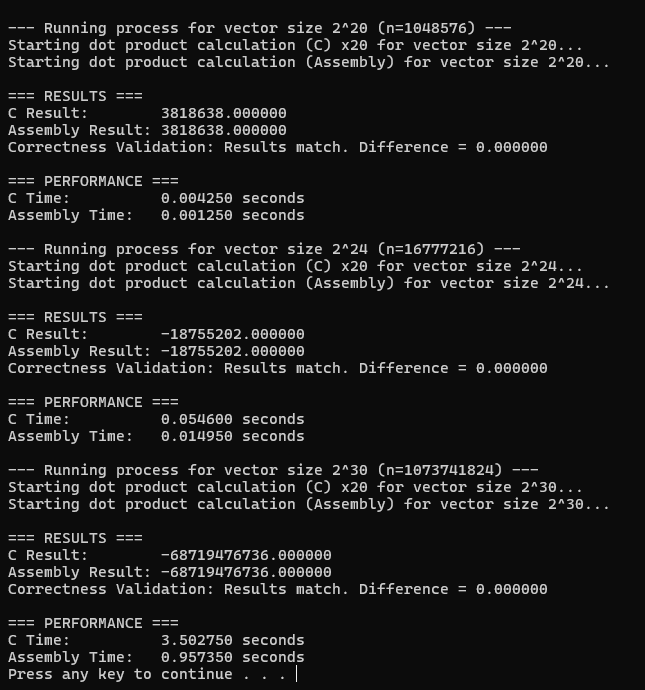
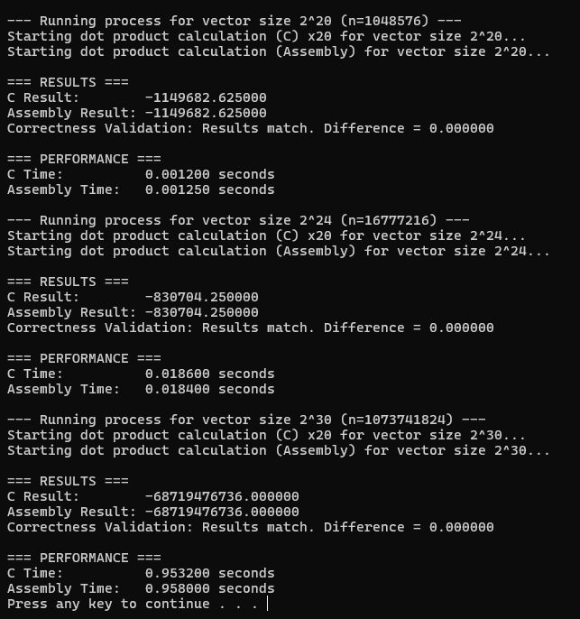

# LBYARCH-MP2
Cu, Monica Keisha

Diamante, Deo Zamir

## I. Project Overview
This project implements a dot product kernel in both:
- **C (scalar implementation)**
- **x86-64 assembly using scalar SIMD instructions**

The kernels are tested with vector sizes \(n = 2^{20}, 2^{24}, 2^{30}\) (reduced if needed for memory limits). Each kernel is run **20 times** to calculate the **average execution time**. Correctness of the assembly kernel is verified against the C kernel.

### To Build and Run:

#### Folder Mode
1. Open Visual Studio *(Both members used Visual Studio 2026)*
2. Click File → Open → Folder
3. Select the DotProductSIMD folder
4. On the top toolbar, set the following:
  - **Startup Item:** `DotProductSIMD.vcxproj`
  - **Configuration:** `Debug` or `Release`
  - **Platform:** `x64`
5. Then choose one of the following:
  - Press: `Ctrl + F5` *(build and run without debugging)*
  - Or click the **green triangle** icon *(Start Without Debugging)*

#### Open Solution
1. Double click the .slnx file in "...\DotProductSIMD\DotProductSIMD.slnx"
2. On the top toolbar, set the following:
  - **Solution Configuration:** `Debug` or `Release`
  - **Solution Platform:** `x64`
3. Then choose one of the following:
  - Press: `Ctrl + F5` *(build and run without debugging)*
  - Or click the **green triangle** icon *(Start Without Debugging)*

***Alternate Option***
*(for seeing running program only in case opening/running in Visual Studio doesn't work properly, source files are still in the folder for viewing/inspecting)*
- Open x64 folder "...\LBYARCH-MP2\DotProductSIMD\x64"
- Choose between Debug or Release folders
- run DotProductSIMD.exe

---

## Program Design

### 1. Objective

The objective of this program is to implement a **dot product kernel** in two ways:

1. A **C implementation** 
2. An **x86-64 Assembly implementation** using **scalar SIMD registers and scalar floating-point instructions**

Both implementations compute the dot product:

sdot = A[0] * B[0] + A[1] * B[1] + ... + A[n-1] * B[n-1]

where:
- `A` and `B` are vectors of **single-precision floats**
- `n` is the number of elements
- `sdot` is a single-precision floating-point scalar value

The final result is stored in memory and displayed for both versions. The C version also serves as the **sanity check** for validating the correctness of the assembly implementation.

---

### 2. Kernel Design

#### 2.1 C Kernel

The C kernel implements the dot product using a simple loop:

- It iterates from `0` to `n - 1`.
- At each iteration, it multiplies elements `A[i]` and `B[i]`.
- The product is accumulated into a floating-point accumulator.

This implementation relies on the compiler to handle floating-point operations. It acts as the baseline reference for correctness verification and performance comparison.

---

#### 2.2 x86-64 Assembly Kernel

The assembly kernel computes the dot product using:

- **Scalar SIMD registers** (XMM registers)
- **Scalar SIMD floating-point instructions**, such as:
  - `MOVSS` (move scalar single-precision float)
  - `MULSS` (multiply scalar single-precision floats)
  - `ADDSS` (add scalar single-precision floats)

The assembly function follows the Windows x64 calling convention and receives:
- `vec1` pointer
- `vec2` pointer
- pointer to `sdot`
- `n` (vector size)

Each loop:
1. Loads `A[i]` and `B[i]` into XMM registers using `MOVSS`.
2. Multiplies them using `MULSS`.
3. Accumulates the result using `ADDSS`.
4. Stores the final accumulated result into memory at `sdot`.

This implementation explicitly uses SIMD registers even though the operations are scalar, as required by the specification.

---

### 3. Main Program Flow (`main.c`)

The `main.c` file serves as the driver program for both kernel implementations.

Its responsibilities include:

#### 3.1 Vector Setup

- Dynamically allocates two vectors (`vec1` and `vec2`) based on input size `n`.
- Fills each vector with randomly generated floating-point values between **-100.0 and 100.0**.
- Supports large vector sizes, specifically:
  - `2^20`, `2^24`, and `2^30`.

---

#### 3.2 Kernel Execution

For each vector size:

1. The C kernel is executed **20 times**.
2. The assembly kernel is executed **20 times**.
3. The average execution time for each kernel is computed using `clock()` from `<time.h>`.

This repetition improves timing accuracy by reducing noise from system scheduling and background processes.

---

#### 3.3 Correctness Validation

After execution:

- The output of the assembly kernel is compared with the result from the C kernel.
- The absolute difference is computed using:

difference = |sdot_C - sdot_ASM|

Validation rule:
- If difference ≤ 0.001 → **Correct**
- If difference > 0.001 → **Mismatch**

The program prints whether:
- The results match, or  
- There is a mismatch.

---

#### 3.4 Output Display

For each vector size, the program prints:

- C result
- Assembly result
- Correctness validation status
- Average execution time for both kernels

This satisfies the requirement that **both kernel outputs must be displayed and validated**.

---

### 4. Design Compliance Summary

This program satisfies all given specifications:

- ✔ Dot product kernel implemented in both C and x86-64 assembly
- ✔ Uses scalar SIMD registers and scalar floating-point instructions
- ✔ C version used as a sanity check reference
- ✔ Results stored in single-precision float (`sdot`)
- ✔ Outputs displayed for both kernels
- ✔ Performance measured and compared for different input sizes

## II. Build Configurations

This project was tested in both **Debug** and **Release** modes:

- **Debug Mode**
  - Used for correctness checking and verification.
  - No or minimal optimization; slower execution.

- **Release Mode**
  - Used for performance measurement.
  - Full compiler optimizations enabled.

---

## III. Execution and Results

Each kernel was executed **20 times**, and the average execution time was recorded.
The C version is treated as the reference for correctness checking.

### A. C Kernel

| Vector Size | Avg. Time (Debug) | Avg. Time (Release) | Notes |
|------------|-----------------|-------------------|------|
| 2^20       | 0.003400 s         | 0.000950 s           | Correctness passed |
| 2^24       | 0.054500 s         | 0.014850 s           | Correctness passed |
| 2^30       | 3.491450 s         | 1.006050 s           | Correctness passed |

### B. x86-64 Assembly Kernel

| Vector Size | Avg. Time (Debug) | Avg. Time (Release) | Notes |
|------------|-----------------|-------------------|------|
| 2^20       | 0.000950 s         | 0.000950 s           | Correctness passed |
| 2^24       | 0.015100 s         | 0.014950 s           | Correctness passed |
| 2^30       | 0.964900 s         | 0.968600 s           | Correctness passed |

### Performance Analysis
- The Release configuration runs significantly faster than Debug due to compiler optimizations.
- In Debug mode, the assembly implementation is noticeably faster for larger input sizes.
- In Release mode, the C compiler optimizations reduce the performance gap, making C and Assembly closer in speed.
- x86-64 assembly kernel slightly outperforms C kernel for large vectors because of SIMD scalar floating-point instructions.
- For smaller input sizes, performance differences are minimal due to overhead such as function calls, loop control, and memory handling dominating execution time.

---

## IV. Screenshots

### A. Debug Build Output

### B. Release Build Output

## V. Demonstration Video

- C, Assembly, and Main Source Code + Execution [https://youtu.be/fnofO-52lmI]

https://github.com/user-attachments/assets/40552390-7417-49d1-ab84-b301da0d44c2

